# Experiment flow creation

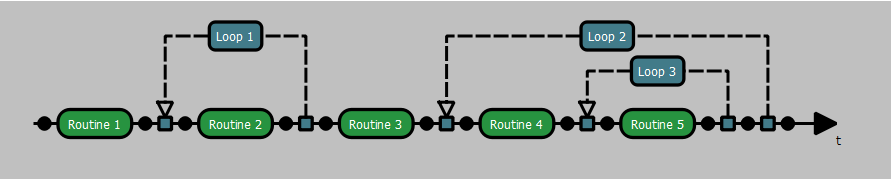

The flow creation panel is the place where you can define the structure of your experiment by placing elements on the arrow.
You have 3 differents available elements:

For adding a new element, first you need to chosse a node:

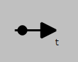

Then click on the black ball, it will display 2 differents choices:

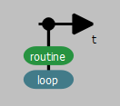

You can either validate a choice by clicking on the corresponding button or canceling it by clicking anywhere on the grey part.

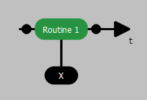

Here a [routine](cpp-projects/_build/bin/exvr-designer/data/documentation/doc_ui_element_selection.md#routine) has been created.
The [routine](cpp-projects/_build/bin/exvr-designer/data/documentation/doc_ui_element_selection.md#routine) is the base container used in experiments, it contains conditions which number depends from its position inside loops. When created outside a loop they only contains a "default" condition.

You can easily move any [routine](cpp-projects/_build/bin/exvr-designer/data/documentation/doc_ui_element_selection.md#routine) by selecting it: 

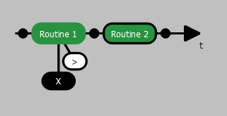

Then clicking on the right or left arrow: 

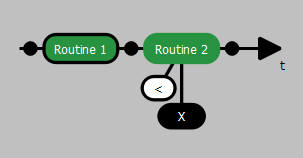
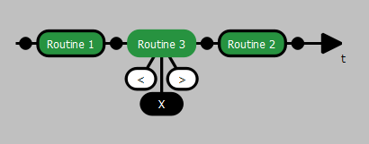

The cross button can remove any element.

If you create a [loop](cpp-projects/_build/bin/exvr-designer/data/documentation/doc_ui_element_selection.md#loop):

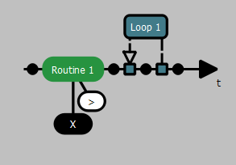

You can move either the [routine](cpp-projects/_build/bin/exvr-designer/data/documentation/doc_ui_element_selection.md#routine) to put it inside, or extending the [loop](cpp-projects/_build/bin/exvr-designer/data/documentation/doc_ui_element_selection.md#loop): my moving its left or right node to englobe the [routine](cpp-projects/_build/bin/exvr-designer/data/documentation/doc_ui_element_selection.md#routine).

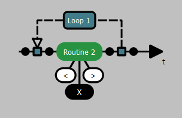
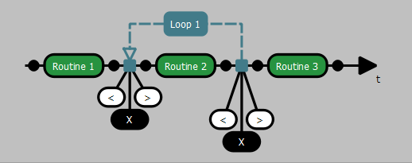

You can move a node [loop](cpp-projects/_build/bin/exvr-designer/data/documentation/doc_ui_element_selection.md#loop): to englobe another one, but loops nodes cannot overlap.

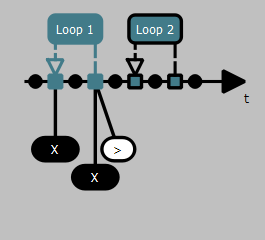
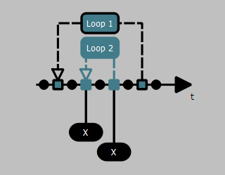
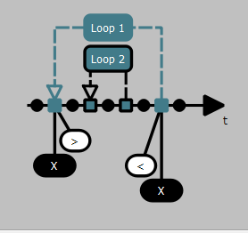

It's possible to transform a [routine](cpp-projects/_build/bin/exvr-designer/data/documentation/doc_ui_element_selection.md#routine) into a [randomizer](cpp-projects/_build/bin/exvr-designer/data/documentation/doc_ui_element_selection.md#randomizer).

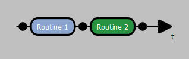

It behaves exactly like an empty [routine](cpp-projects/_build/bin/exvr-designer/data/documentation/doc_ui_element_selection.md#routine) and it is used mostly for creating complexes randomizations or as an indicator to separate sections in the flow.

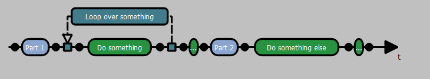

You can zoom using this bar or adapt the view to the scene by clicking on the button.

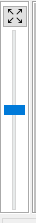

